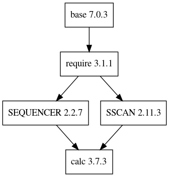

# Deprecation notice

2020-08-20: This remote has been deprecated. Moved to https://gitlab.esss.lu.se/e3/common/e3-calc.

e3-calc
===
ESS Site-specific EPICS module : calc

## Dependency Plot

||
| :---: |
|**Figure 1** Depdendency Tree. |

## Features
We enable the following two modules as default:

* SSCAN  for the swait record
* SNCSEQ for editSseq.st
